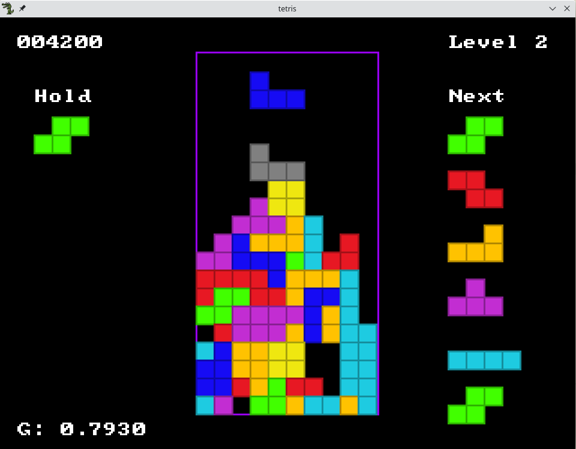

# Tetris

A simple implementation of the popular falling block game.



## Prerequisites

### Debian

```bash
sudo apt install liballegro5-dev make
```

### Windows

- Visual Studio. All dependencies should be automatically restored as needed by NuGet.

## Tasks

- [x] Restore the "remaining lines" text
- [x] Add a "lines cleared" text
- [x] Add a locking delay for soft locking
- [ ] Add some background graphics (maybe this could be based on the level?)
- [ ] Add a sound effect for when rotation fails
- [ ] Add a sound effect for leveling up
- [ ] Add a timer to the HUD
- [ ] Add some special effects for when lines are cleared (perhaps even animate the lines clearing)
- [ ] Detect T-Spins for scoring
- [ ] Detect combos for scoring
- [ ] Detect lock-out (locking down above the play area)
- [ ] Add a countdown before starting
- [ ] Fix up the input (it doesn't feel right)
- [ ] Add a sprint, marathon, ultra, and endless modes.
- [ ] Add highscores for each mode
- [ ] Add a menu system
- [ ] Add a way to pause the game
- [ ] Add support for joystick (with haptic feedback)
